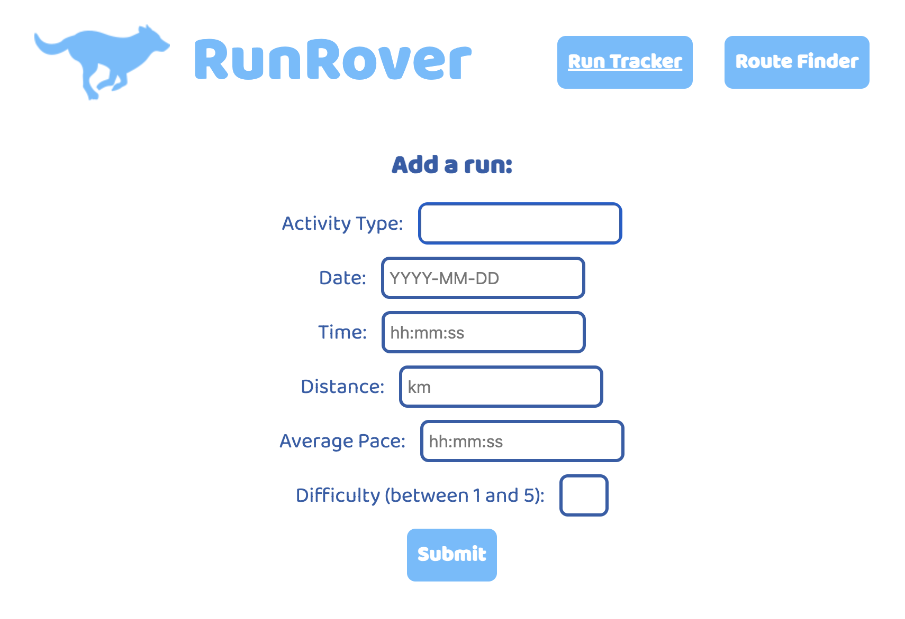
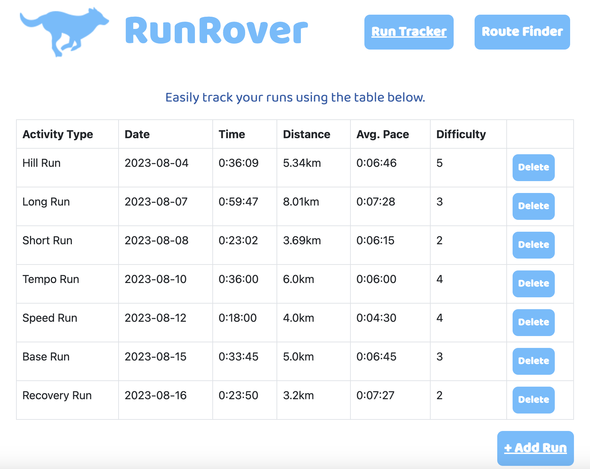

*RunRover* is a web app where users can track their running data in a functional and aesthetically pleasing user interface.
Each run entry includes information about the activity type, date, time the activity took, distance, average pace, and difficulty.
The table is connected to a database that stores the data and reflects any changes made, like adding and deleting a run.

I created *RunRover* as a way to better view my running statistics all in one place, as the app I currently use keeps activity comparisons
behind a paywall. Now, I want to expand that by including other functionalities that most running apps don't offer like a route
finder that takes a starting point, ending point, and distance as input and suggests a run that meets those criteria, and a tool that
uses machine learning and your previous run data to suggest your next run such that it is sufficiently challenging for athletic improvement.

Additionally, the creation of this app almost entirely required me to learn new languages and frameworks. Taking my experience in Python and VSCode (among other languages and tools) I self-taught HTML, CSS, SQL, MySQL, Flask, Flask-SQLAlchemy, and Bootstrap and applied them to this personal project. I built this project from design to implementation, and I used Figma to better plan out what I wanted my app to look like (which you can view [here](https://www.figma.com/file/Na66RDS9MTSpz1VRPwxOLB/RunRover?type=design&node-id=0%3A1&mode=design&t=SQcPYoABqkfsXPWd-1)).

## Features
- Add a run to the database with its associated data: activity type, date, time the activity took, distance, average pace, and difficulty (on a scale of 1 to 5).

  

- View all of your runs in a clean and organized table.

  

- Delete a run from the database.

## Future Plans
- Create a version of the project that utilizes an SQLite database instead of MySQL.
  - SQLite is admittedly better fitting for this project than MySQL, but I wanted to gain experience in MySQL so I chose it as the first
  step. Additionally, this would allow others to use the app on their own machines.
- Add the 'Route Finder' tab that utilizes the Google Maps API to generate a running route given a starting point, ending point, and distance.
- Use a machine learning tool to suggest your next run that is sufficiently challenging to ensure progressive overload given your previous running data.

## How to use
The current iteration of this project utilizes a locally hosted MySQL server, so it is not currently usable by others.

Here is a use example: 

<video width="500" src="https://github.com/robinmatheson/RunRover/assets/125790030/d9bda3a9-da4b-4a3f-b798-0d868d2c896d"/>

